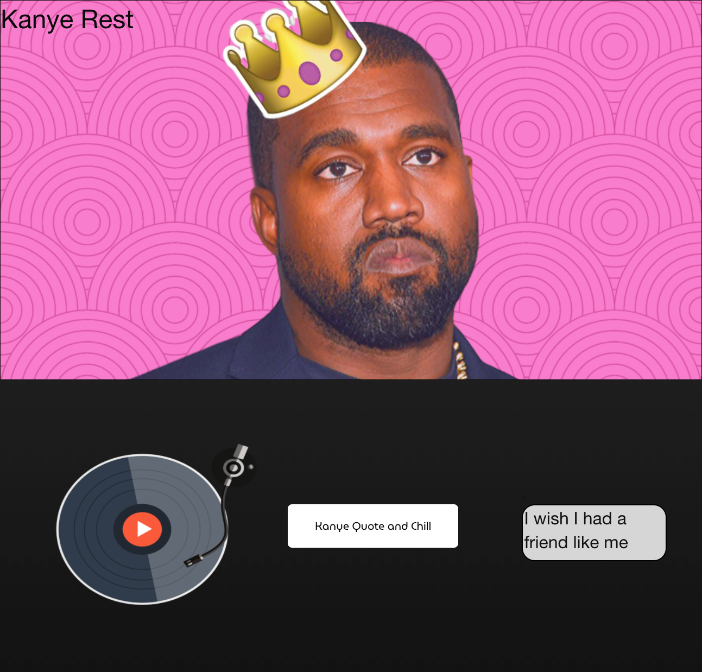

# [Kanye Rest](https://emilyepozzi.github.io/p1-g13/)

## *User Story*
AS a musical connoisseur and a fan of Kanye West, 
\
**I WANT** to have a website with a music player that also gives me quotes from Kanye West.
\
**SO THAT** 
I can enjoy music while also getting inspiration from Kanye.

## *Acceptance Criteria*
*WHEN* a user visits the site,\
*THEN* they can play music.\
*WHEN* the user clicks on the 'Kanye Qoute and Chill' button, \
*THEN* they are shown a philosophical quote from Kanye.\
*WHEN* the user clicks both of these buttons,\
*THEN* they are both smarter and chiller. 

## *Website Link*
[Kanye Rest](https://emilyepozzi.github.io/p1-g13/)

## *Built With*
*Languages:* HTML, CSS, JavaScrypt, JQuery.
*CSS Framework:* [Foundation](https://get.foundation/)
*API`s Used:* [Napster API]() & [Kanye West API](https://api.kanye.rest/).

## *Contributors*
* Emily Pozzi 
* Brandon Shoemaker
* Dana Shephard
* Brian Munoz
